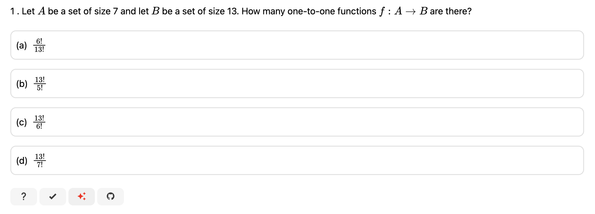
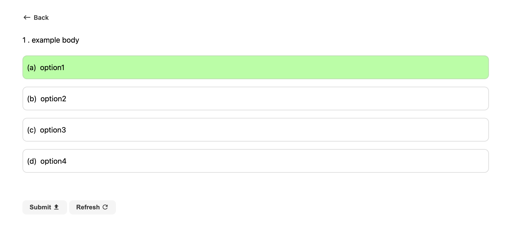

# Contributing Generators

In this project, a "generator" is a class that creates new varients of an existing question.

Checkout the example generator for question "COMP 2804 Midterm 2013 - 1" [here](https://questions.carletoncomputerscience.ca/questions/generator/comp2804/2013-fall-midterm/1).

Users can navigate to a question's generator to practice that specific question varient by clicking on the "create sparkles" found under the original question.

Any question where the "create sparkles" are disabled is a question that does not currently have an associated generator and is an oppurtunity for a student to contribute to the project.



<br/>

# Create a Generator

## TLDR: Follow the golden example

The Golden example for how generators should be implemented is stored here: `src/content/questions/comp2804/2013-fall-midterm/1`

## 1. Find your base question

Each generator is associated with a base question, so we need to first find where that question is stored in the project.

Each question is stored within the project's `src/content/questions` folder.

Inside that folder, you'll find many sub folders with the path pattern `{evaluation}/{question number}` continue to the folder of your base question.

## 2. Create your `generator.ts` file

Create a `generator.ts` file in your question's folder and copy paste this base code into your `generator.ts`.

```typescript
import { MultipleChoiceQuestionGenerator } from "@common/MultipleChoiceQuestionGenerator";
import type {
  MultipleChoiceQuestion,
  MultipleChoiceQuestionOption,
} from "@common/MultipleChoiceQuestionGenerator";

class Generator extends MultipleChoiceQuestionGenerator {
  generateQuestion(): MultipleChoiceQuestion {
    return {
      body: "example body",
      options: [
        {
          label: "option1",
          correct: true,
        },
        {
          label: "option2",
          correct: false,
        },
        {
          label: "option3",
          correct: false,
        },
        {
          label: "option4",
          correct: false,
        },
      ],
    };
  }
}

export default Generator;
```

## 3. Associate your generator and question

For the website to know your generator exists, you need to update your questions `index.md` file as shown where `{evaluation}` and `{question-number}` are replaced with the data related to your question.

```diff
---
title: N/A
path: comp2804/{evaluation}/{question-number}
type: multiple-choice
author: Pat Morin
question: comp2804/{evaluation}/{question-number}/question.ts
+ generator: comp2804/{evaluation}/{question-number}/generator.ts
```

If you now navigate to your question in the website, the "create sparkles" will now be clickable and should take you to appears like the following:



## 4. Implementing your generator

At this point, it's up to you to understand the logic behind how your question works to determine how your ``generator.ts` should generate the "body" and option "label" strings that are returned back by the generator. You can structure your class methods however you'd like or in whatever way best suits the approach needing for the problem.

Check if your question already has a written `solution.md` file to verify your logic matches the solution for the question.

## 5. Add Tests

For each generator please create an associated `generator.test.ts` file with unit tests that verify the behavior of your code.

You can run these tests by running the whole test suite: `npm run test` or by running your specific test file `npm run test src/content/questions/comp2804/{evaluation}/{question-number}/generator.test.ts`.

## 6. Create a Pull Request

Create a pull request with your new generator code. If you are unfamilliar with creating a pull request, see [this guide](https://docs.github.com/en/pull-requests/collaborating-with-pull-requests/proposing-changes-to-your-work-with-pull-requests/creating-a-pull-request).
