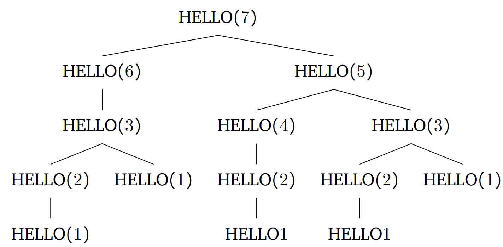

Let's draw a recursive tree to find out how many times the word \enquote{hello} is printed when we run $HELLO(7)$.

As can be seen, the word \enquote{hello} is printed 5 times when we run $HELLO(7)$.
