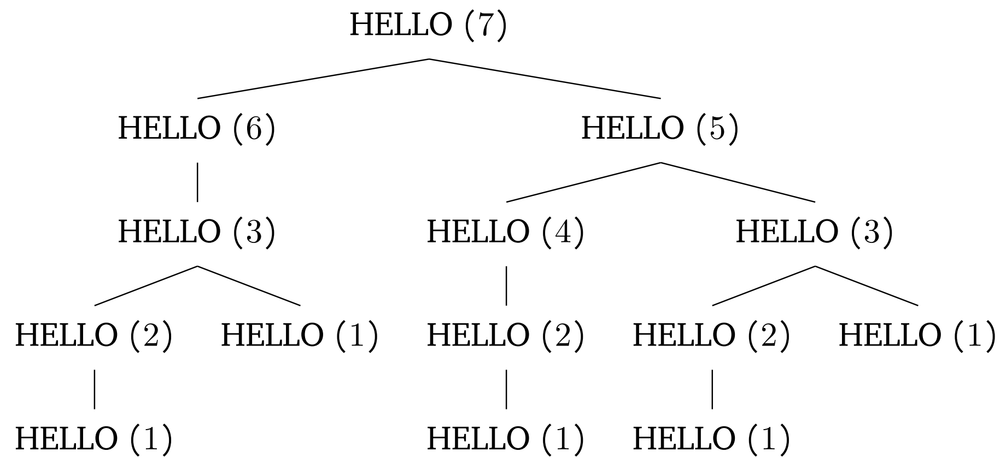

\enquote{hello} is printed when HELLO is called with an argument of 0 or 1.
We can draw a recursive tree to see how many times the HELLO$(1)$ is called.

HELLO$ (1) $ is called 5 times. Thus, \enquote{hello} is printed 5 times.
