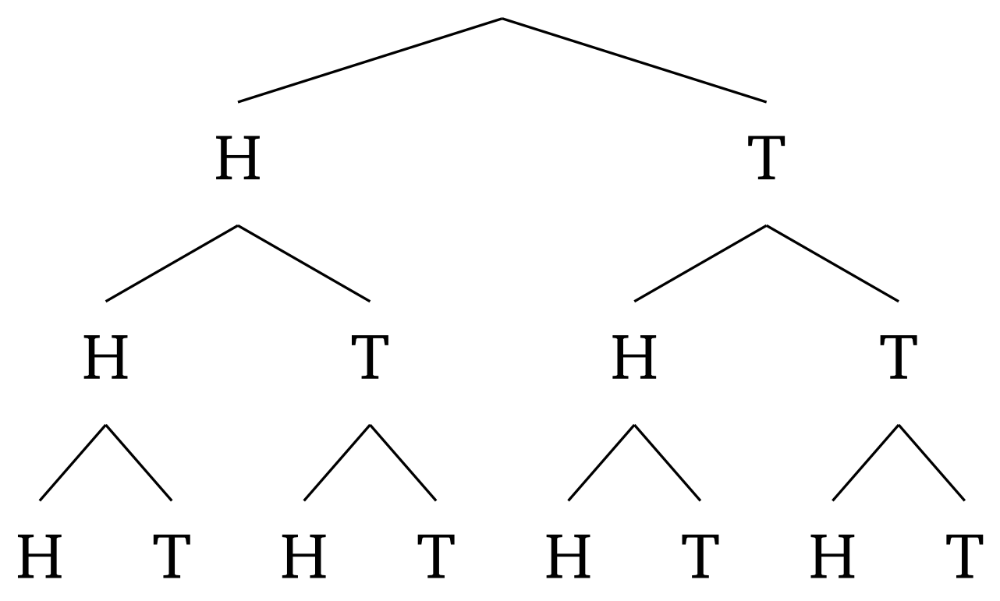

Okay, there are two ways to go about this

<ul>
    <li> The first is to realize that the chance the coin comes up a certain face an odd or even number of times is straight up $ \frac{1}{2} $   
    Screw drawing out the whole 5-level deep recursive tree. We can just draw out a 3-level deep tree   
       
    If you notice, our first flip gets us a head or a tail, which is a 50/50 chance.   
    The first flip doubles the possibilities   
    If after flipping a heads we flip a heads again, this creates an even number of tails BUT the probability is kept the same by the fact that another possibility is HT   
    If after flipping a tails we flip a tails, it's even BUT the counter is that we could land a TH, which brings the probability back to 50/50   
    Ever time we flip the coin to get an odd number of heads, we could just as easily have gotten an even number of tails   
    Some of the exam questions are like this, and it's not really worth the time to brute force calculate   
    It's as intuitive as it is unintuitive
    <li> Second, we can draw out a tree and realize that the probability of getting an odd number of heads is the same as getting an even number of heads
    <li> Third, let's just waste brainpower to solve this   
    <ul>
        <li> Let S be all possible outcomes of the coin flips: $ |S| = 2^5 = 32 $
        <li> Let A represent the event that the coin comes up heads once   
        We choose 1 position out of the 5 for the head: $ \binom{5}{1} $   
        The remaining 4 positions are for the tails: 1   
        $ |A| = \binom{5}{1} $
        <li> Let B represent the event that the coin comes up heads 3 times   
        We choose 3 positions out of the 5 for the heads: $ \binom{5}{3} $   
        The remaining 2 positions are for the tails: 1   
        $ |B| = \binom{5}{3} $
        <li> Let C represent the event that the coin comes up heads 5 times   
        We choose 5 positions out of the 5 for the heads: $ \binom{5}{5} $   
        The remaining 0 positions are for the tails: 1   
        $ |C| = \binom{5}{5} $
    </ul>
    $ Pr(\text{odd number of heads}) = Pr(A) + Pr(B) + Pr(C) $   
    $ Pr(\text{odd number of heads}) = \frac{ \binom{5}{1} + \binom{5}{3} + \binom{5}{5} }{32} $   
    $ Pr(\text{odd number of heads}) = \frac{5 + 10 + 1}{32} $   
    $ Pr(\text{odd number of heads}) = \frac{16}{32} $   
    $ Pr(\text{odd number of heads}) = \frac{1}{2} $
</ul>
