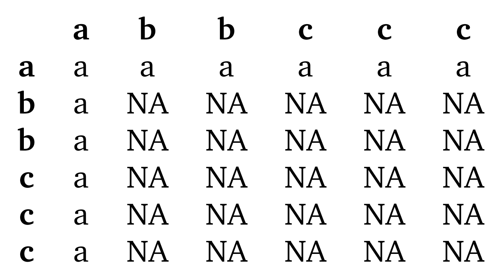
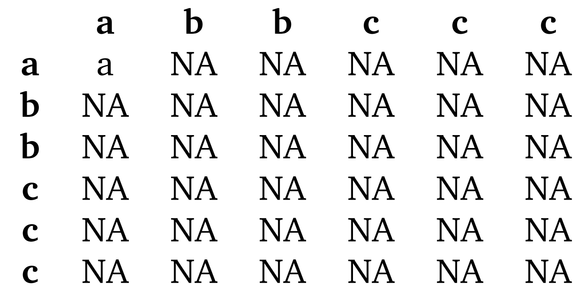

<ul>
    <li> Let's determine $ B $   
    What we care about is when we get an $a$ so let's map that out with a table   
       
    $ |B| = 11 $   
    $ Pr(B) = \frac{11}{36} $
    <li> Let's determine $ A \cap B $   
    We only care about the cases when both rolls result in the same letter AND at least one of the rolls result in the letter $a$   
       
    $ |A \cap B| = 1 $   
    $ Pr(A \cap B) = \frac{1}{36} $
</ul>

$ Pr(A|B) = \frac{ Pr(A \cap B) }{ Pr(B) } $

$ Pr(A|B) = \frac{ \frac{1}{36} }{ \frac{11}{36} } $

$ Pr(A|B) = \frac{1}{11} $
