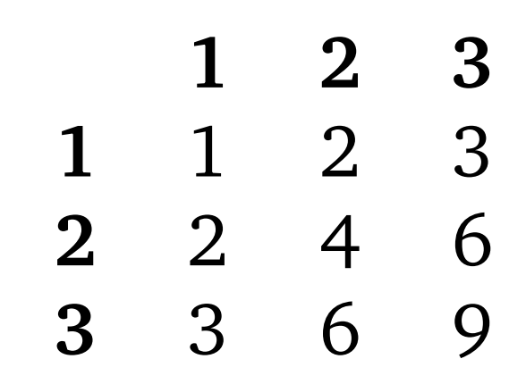

Let $X_i$ be 1 if the product $c_i \cdot c_{i+1}$ is odd

Let A be the event that the product $c_i \cdot c_{i+1}$ is odd

Let's draw a multiplication table, baby

There are 3 odd products: 3, 6, 9

Out of 9 events, the event of an odd product occurs 4 times

$ Pr(A) = \frac{4}{9} $

$ E(X) = \sum\_{k=1}^{n-1} Pr(X_i = 1) $

$ E(X) = \sum\_{k=1}^{n-1} Pr(A) $

$ E(X) = (n-1) \cdot \frac{4}{9} $
