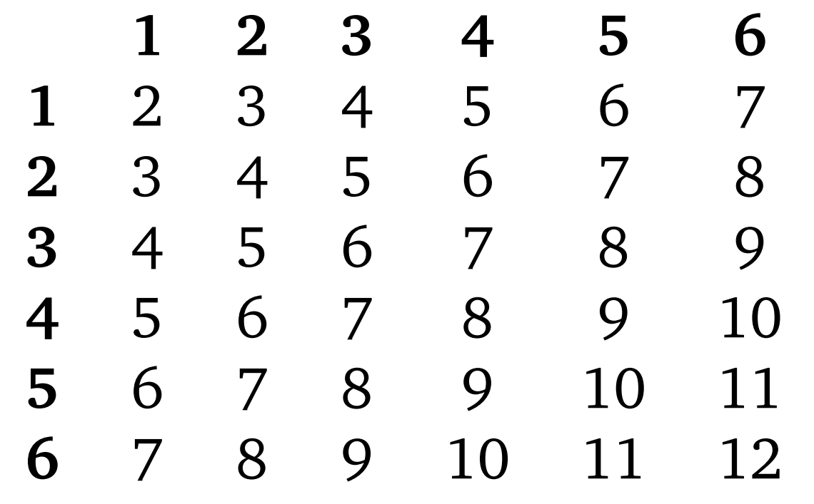

Let's draw out a sum table

We can see that sum of 7 occurs 6 times out of the 36 possible outcomes.

Therefore, the probability of the sum being 7 is $\frac{6}{36} = \frac{1}{6}$.

Now, we use geometric distribution to find the expected value of the number of rolls until the sum is 7.

The expected value of a geometric distribution is $\frac{1}{p}$, where $p$ is the probability of success.

Therefore, the expected value of the number of rolls until the sum is 7 is $\frac{1}{\frac{1}{6}} = 6$.
